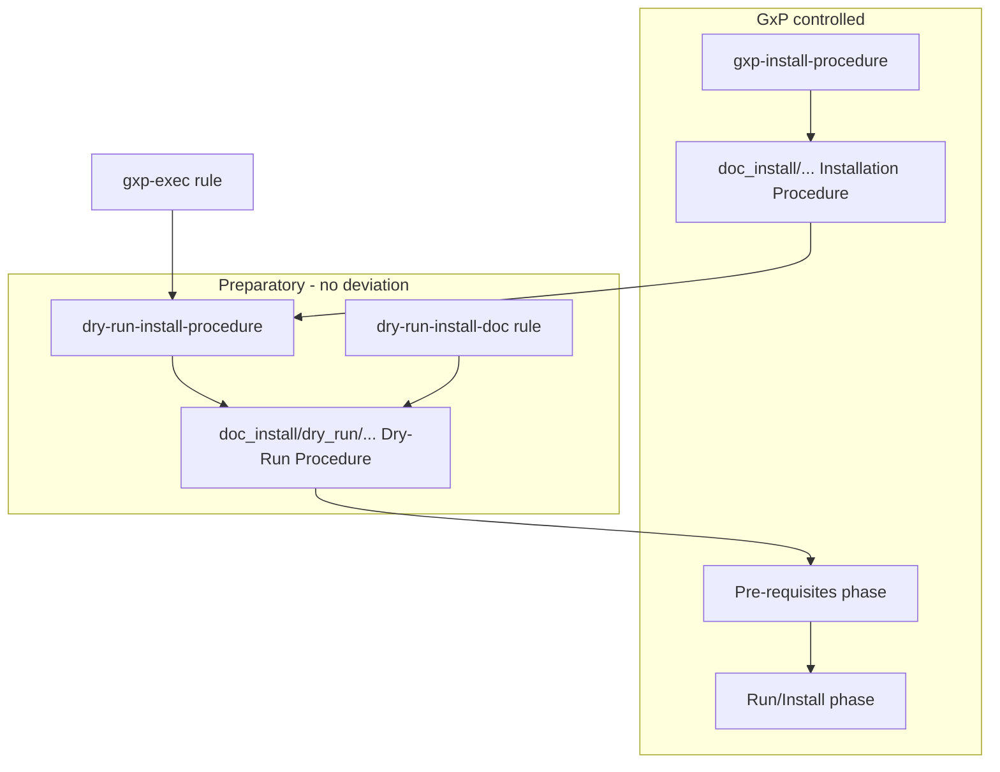

# Dry-Run Install Procedure Skill + Rule

Add two artefacts to [wise-infra-feature-lifecycle](.) that complement the existing [`gxp-exec`](.cursor/rules/gxp-exec.mdc) rule and the global [`gxp-install-procedure`](~/.claude/skills/gxp-install-procedure/SKILL.md) skill.



**Relationship**: `gxp-install-procedure` produces the concise GxP Installation Procedure (60–120 lines, 9 frozen sections). `dry-run-install-procedure` produces the **paired** dry-run document with **maximum operational detail** — every workflow input, job, step, expected log line, artifact path, and mutation guard. The new rule ensures dry-run docs stay current when pipelines or GxP procedures change.

Recommended branch: `feat/dry-run-install-procedure` (separate from open PRs).

---

## 1. Create skill `dry-run-install-procedure`

**Path**: [`.cursor/skills/dry-run-install-procedure/SKILL.md`](.cursor/skills/dry-run-install-procedure/SKILL.md)

**Bundled template**: [`.cursor/skills/dry-run-install-procedure/template.md`](.cursor/skills/dry-run-install-procedure/template.md)

### Frontmatter

- `name`: `dry-run-install-procedure` (kebab-case, consistent with `gxp-install-procedure`)
- `description`: triggers on dry-run install documentation, dry-run execution procedure, preparatory install runbook, `dry_run: true` workflow rehearsal; references pairing with GxP Installation Procedure.

### Core behaviour (skill body)

| Aspect | `gxp-install-procedure` | `dry-run-install-procedure` |
|---|---|---|
| Purpose | GxP Confluence install doc | Preparatory rehearsal doc — **no deviation** |
| Length | 60–120 lines, concise | **No upper limit** — ultra-precise |
| Tone | Imperative, no rationale | Imperative + exhaustive operational detail |
| Language | English | English |
| Output path | `doc_install/eWise - Installation Procedure - <Component> - github.md` | `doc_install/dry_run/eWise - Dry-Run Installation Procedure - <Component> - github.md` |

### Frozen document structure (skill enforces order)

Reuse GxP sections **1–5 verbatim** from [`gxp-install-procedure/template.md`](~/.claude/skills/gxp-install-procedure/template.md) (`Purpose` through `Glossary`), then dry-run-specific sections:

1. **Document Control** — mandatory banner `MODE: DRY-RUN`; link to paired GxP Installation Procedure; dry-run run ID; Git branch/SHA; operator; timestamp (UTC); automation command (`dry_run: true` / `--dry-run`).
2. **Introduction** — component scope + explicit statement: preparatory only, repeatable, generates **no deviation** ([`gxp-exec`](.cursor/rules/gxp-exec.mdc)).
3. **Prerequisites (read-only verification)** — bullet checklist of what the operator **verifies** before dry-run (not GxP execution); each item: check + how to verify + expected result.
4. **Automation Entry Point** — workflow file path, trigger type, full `workflow_dispatch` inputs table (name, type, default, required, description).
5. **Pipeline Mirror (step-by-step)** — for **every** job and step in the source workflow: step name, runner, condition (`if:`), tools installed, commands run, continue-on-error behaviour, secrets/env vars referenced (names only, no values).
6. **Expected Actions** — per step, expected dry-run log pattern (`[dry-run] would ...` or equivalent); expected exit code.
7. **Expected Outputs and Artifacts** — paths, filenames, retention, upload targets; mark each as dry-run labelled.
8. **Mutation Guard** — explicit table of systems/datasets/environments that **must not** change during dry-run.
9. **Operator Verification Checklist** — numbered post-run checks the operator performs on dry-run logs/artifacts.
10. **Traceability and Evidence** — what to attach to the rehearsal ticket (run URL, log excerpts, artifact hashes); note: **not** GxP deployment evidence.
11. **Sync with GxP Installation Procedure** — diff checklist: when the GxP install doc changes (tag patterns, inputs, pipeline file), this dry-run doc must be updated in the same PR.

### Workflow (skill checklist)

1. Locate paired GxP Installation Procedure (`doc_install/eWise - Installation Procedure - <Component> - github.md`) — if missing, run `gxp-install-procedure` first or ask user.
2. Read source pipeline (`.github/workflows/<name>.yml`) — mirror every job/step.
3. Copy bundled `template.md` to `doc_install/dry_run/...`.
4. Fill all sections; mark missing data as `MISSING` (never invent URLs or tag values).
5. Validate structure (skill provides `rg` one-liner counting required `##` headings + grep for `MODE: DRY-RUN`).
6. Optional publish: delegate to `confluence-page-generator` only if user requests Confluence (out of default scope).

### Reference anchor in this repo

Use [`.github/workflows/publish-wise-feature-lifecycle.yml`](.github/workflows/publish-wise-feature-lifecycle.yml) `dry_run` input as the canonical automation example in skill docs.

---

## 2. Create rule `dry-run-install-doc`

**Path**: [`.cursor/rules/dry-run-install-doc.mdc`](.cursor/rules/dry-run-install-doc.mdc)

### Purpose

Enforce **permanent, high-detail maintenance** of dry-run install procedures whenever install-related assets change.

### Globs (auto-attach)

- `doc_install/**/*.md`
- `doc_install/dry_run/**/*.md`
- `.github/workflows/**/*install*.y*ml`
- `.github/workflows/**/*publish*.y*ml`
- `.github/workflows/**/*deploy*.y*ml`
- `scripts/**/*install*.py`
- `scripts/**/*publish*.py`

### Rule content (minimum)

- Every GxP Installation Procedure under `doc_install/` (excluding `dry_run/`) **must** have a paired dry-run doc under `doc_install/dry_run/` with matching component name.
- When changing any install/deploy/publish workflow or GxP install procedure, **update the paired dry-run doc in the same PR** (or explicitly document why not in the PR description).
- Dry-run docs **must** contain: `MODE: DRY-RUN` banner, link to GxP procedure, full workflow inputs table, per-step expected actions, mutation guard, operator verification checklist.
- Dry-run docs **must not** be shortened below the detail level of the source workflow (if a new workflow step is added, the dry-run doc gains a matching step entry).
- Cross-reference [`gxp-exec`](.cursor/rules/gxp-exec.mdc): dry-run documentation is preparatory; deviations apply only to pre-requisites and run/install.
- Use skill `dry-run-install-procedure` to create or refresh docs.

---

## 3. Register in Skills Portal profile

In [`scripts/feature_lifecycle/publish_wise_feature_lifecycle_profile.py`](scripts/feature_lifecycle/publish_wise_feature_lifecycle_profile.py):

- Add skill `ArtifactSpec` after `gxp-unit-test-report-generator` (logical GxP cluster):

```python
ArtifactSpec(
    name="dry-run-install-procedure",
    artifact_type="skill",
    source_path=".cursor/skills/dry-run-install-procedure",
    description="Write ultra-detailed dry-run Installation Procedure docs paired with GxP install procedures.",
),
```

- Add rule `ArtifactSpec` after `gxp-exec`:

```python
ArtifactSpec(
    name="dry-run-install-doc",
    artifact_type="rule",
    source_path=".cursor/rules/dry-run-install-doc.mdc",
    description="Keep dry-run install procedure docs in sync and at required detail level.",
),
```

Profile item count after change: **24 local + 2 external = 26 items** (17 skills, 7 rules).

---

## 4. Update README

In [`README.md`](README.md):

- Profile heading: `22 artefacts` → `24 artefacts`
- Skills table: add row 17 `dry-run-install-procedure`
- Rules table: `Rules (6)` → `Rules (7)`, add `dry-run-install-doc`
- Layout tree: `skills/<16 folders>` → `<17 folders>`, `rules/<6 files>` → `<7 files>`
- Live-state row: `22 (16 skills, 6 rules)` → `24 (17 skills, 7 rules)`

---

## 5. Seed example (this repo)

Create a **reference dry-run doc** for the publish workflow (first consumer):

- [`doc_install/dry_run/eWise - Dry-Run Installation Procedure - wise-feature-lifecycle profile - github.md`](doc_install/dry_run/eWise - Dry-Run Installation Procedure - wise-feature-lifecycle profile - github.md)

This demonstrates the ultra-detail standard and pairs with a future GxP install procedure for the same component. Keeps `doc_install/dry_run/.gitkeep` if needed for empty-dir tracking.

---

## 6. Verify

- `python3 scripts/feature_lifecycle/validate_feature_manifests.py` (unaffected, should stay green)
- Structural check on seeded doc (section count + `MODE: DRY-RUN`)
- INT dry-run publish:

```bash
gh workflow run "Publish wise-feature-lifecycle" --ref feat/dry-run-install-procedure \
  -f environment=int -f version=1.1.0 -f dry_run=true
```

Expect `[dry-run] would publish skill dry-run-install-procedure` and `[dry-run] would publish rule dry-run-install-doc`.

---

## Out of scope

- Editing the global `~/.claude/skills/gxp-install-procedure` skill (referenced, not copied)
- OpenSpec change (standalone addition; can add on request)
- Bootstrap template for `doc_install/dry_run/` (optional follow-up)
- Real Confluence publish of dry-run docs (skill documents path; Confluence only on explicit user request)
