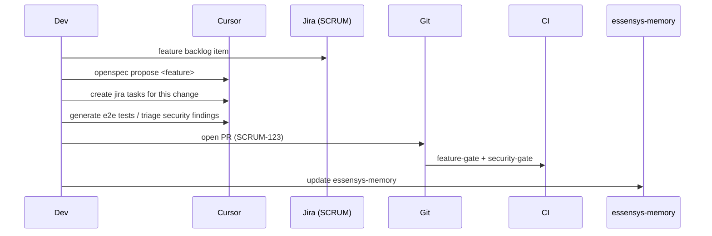

# Daily workflow

Goal: follow the full cycle Jira → OpenSpec → code → tests → security → deploy, with the fewest prompts and complete traceability.

## Step 1 — Start from the backlog

The feature exists as an item in the **Jira SCRUM** project:
<https://essensys-hub.atlassian.net/jira/software/projects/SCRUM/boards/1/backlog>

The Jira API token is encrypted with SOPS. For Jira API calls / skills, export it as an ephemeral env var:

```bash
cd essensys-ansible
export SOPS_AGE_KEY_FILE="$HOME/.config/sops/age/keys.txt"
export JIRA_SECRET="$(sops -d --extract '["JIRA_SECRET"]' secrets/cloud/essensys.sops.yaml)"
```

> Never put the token in clear text in a file, a log or a commit. See `AGENTS.md` → Secrets & SOPS.

## Step 2 — Generate the OpenSpec change

In Cursor:

```text
openspec propose <feature>
```

This produces the change: proposal, design, specs and tasks. It is the feature contract.

## Step 3 — Break down into Jira epics / stories / tasks

In Cursor:

```text
create jira tasks for this change
```

Tasks are created in Jira (SCRUM project), linked to the OpenSpec change and to `features/<id>.json`.

## Step 4 — Implement

Code against the specs, open-source toolchain only. The manifest stays the source of truth; link each commit/PR to its Jira key `SCRUM-123` (`github-issue-done-commit-push`).

## Step 5 — Test (test · test · test)

```text
generate e2e tests for this feature
```

Unit + integration + Playwright E2E linked to the manifest. Nothing ships without green tests.

## Step 6 — Security gate

```text
triage security findings
```

Always start with secrets, then Critical/High. The gate is **blocking**.

## Step 7 — Continuous documentation

```text
sync user guide for this feature
```

Documentation is updated **throughout**, not at the end.

## Step 8 — Deploy (local + OVH)

Deploy to the local gateway and to OVH via `essensys-ansible` (see install docs).

## Step 9 — Review & memory

Self-critique at every step (Bugbot / security-review before PR), then:

```text
update essensys-memory
```

## Diagram


