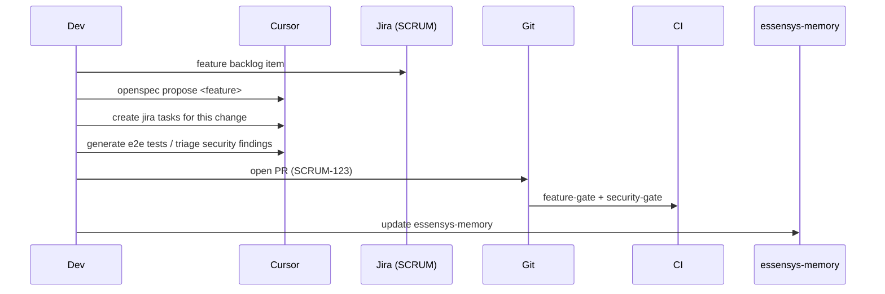

# Workflow quotidien

Objectif : suivre le cycle complet Jira → OpenSpec → code → tests → sécurité → deploy, avec le minimum de commandes et une traçabilité complète.

## Étape 1 — Partir du backlog

La feature existe comme item dans le projet **Jira SCRUM** :
<https://essensys-hub.atlassian.net/jira/software/projects/SCRUM/boards/1/backlog>

Le token API Jira est chiffré avec SOPS. Pour les appels API / skills Jira, l'exporter en variable d'env éphémère :

```bash
cd essensys-ansible
export SOPS_AGE_KEY_FILE="$HOME/.config/sops/age/keys.txt"
export JIRA_SECRET="$(sops -d --extract '["JIRA_SECRET"]' secrets/cloud/essensys.sops.yaml)"
```

> Jamais de token en clair dans un fichier, un log ou un commit. Voir `AGENTS.md` → Secrets & SOPS.

## Étape 2 — Générer la spec OpenSpec

Dans Cursor :

```text
openspec propose <feature>
```

Cela produit le change : proposal, design, specs et tasks. C'est le contrat de la feature.

## Étape 3 — Découper en epics / stories / tasks Jira

Dans Cursor :

```text
create jira tasks for this change
```

Les tasks sont créées dans Jira (projet SCRUM) et reliées au change OpenSpec et au manifest `features/<id>.json`.

## Étape 4 — Coder

Implémente selon les specs, toolchain open source uniquement. Le manifest reste la source de vérité ; relie chaque commit/PR à sa clé Jira `SCRUM-123` (`github-issue-done-commit-push`).

## Étape 5 — Tester (test · test · test)

```text
generate e2e tests for this feature
```

Unitaires + intégration + E2E Playwright reliés au manifest. Rien ne part sans tests verts.

## Étape 6 — Gate sécurité

```text
triage security findings
```

Toujours commencer par les secrets puis les Critical/High. La gate est **bloquante**.

## Étape 7 — Documentation continue

```text
sync user guide for this feature
```

La doc est mise à jour **tout au long**, pas à la fin.

## Étape 8 — Deploy (local + OVH)

Déploiement sur la gateway locale et sur OVH via `essensys-ansible` (cf. doc d'installation).

## Étape 9 — Revue & mémoire

Autocritique à chaque étape (Bugbot / security-review avant PR), puis :

```text
update essensys-memory
```

## Diagramme


