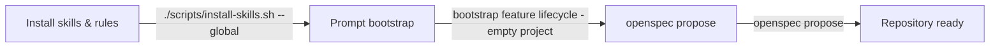

# Start an empty project

Goal: install the feature lifecycle workflow in a new Essensys repository in a few minutes.

## Prerequisites

- Cursor installed
- access to the `essensys-hub` GitHub org
- `git`, `rsync` (or `cp`), open-source toolchain in place

## Step 1 — Install the skills & rules

Skills and rules live in `.cursor/` of the `essensys-feature-lifecycle` repo (source of truth). Copy them into Cursor.

```bash
# Get the skills source repo
git clone https://github.com/essensys-hub/essensys-feature-lifecycle.git
cd essensys-feature-lifecycle

# Option A — global (available in every repo)
./scripts/install-skills.sh --global        # → ~/.cursor

# Option B — into a specific target repo
./scripts/install-skills.sh /path/to/my-repo   # → my-repo/.cursor
```

> Without the script, the equivalent manual copy is:
> `rsync -a .cursor/skills/ ~/.cursor/skills/ && rsync -a .cursor/rules/ ~/.cursor/rules/`

Then open the target repo in Cursor: the 14 skills and 7 rules load automatically.

## Step 2 — Ask Cursor to bootstrap the repository

In Cursor:

```text
bootstrap feature lifecycle - empty project
```

The bootstrap skill proposes to create:

- `features/schema/feature.schema.json`
- `.github/workflows/feature-gate.yml`
- `.github/workflows/security-gate.yml`
- `scripts/hooks/pre-commit`
- the starter documentation

## Step 3 — Create the first feature

The feature starts from a **Jira SCRUM** backlog item (<https://essensys-hub.atlassian.net/jira/software/projects/SCRUM/boards/1/backlog>), then:

```text
openspec propose <feature>
```

The OpenSpec change and the `features/<id>.json` manifest are created; Cursor lists what still needs a human.

## Diagram


