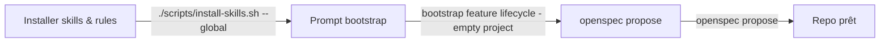

# Démarrer un projet vide

Objectif : installer le workflow feature lifecycle dans un nouveau repo Essensys en quelques minutes.

## Prérequis

- Cursor installé
- accès à l'org GitHub `essensys-hub`
- `git`, `rsync` (ou `cp`), toolchain open source en place

## Étape 1 — Installer les skills & rules

Les skills et rules vivent dans `.cursor/` du dépôt `essensys-feature-lifecycle` (source de vérité). On les copie dans Cursor.

```bash
# Récupérer le dépôt source des skills
git clone https://github.com/essensys-hub/essensys-feature-lifecycle.git
cd essensys-feature-lifecycle

# Option A — global (disponible dans tous les repos)
./scripts/install-skills.sh --global        # → ~/.cursor

# Option B — dans un repo cible précis
./scripts/install-skills.sh /chemin/vers/mon-repo   # → mon-repo/.cursor
```

> Sans le script, copie manuelle équivalente :
> `rsync -a .cursor/skills/ ~/.cursor/skills/ && rsync -a .cursor/rules/ ~/.cursor/rules/`

Ouvre ensuite le repo cible dans Cursor : les 14 skills et 7 rules sont chargés automatiquement.

## Étape 2 — Demander à Cursor d'initialiser le repo

Dans Cursor :

```text
bootstrap feature lifecycle - empty project
```

Le skill propose de créer :

- `features/schema/feature.schema.json`
- `.github/workflows/feature-gate.yml`
- `.github/workflows/security-gate.yml`
- `scripts/hooks/pre-commit`
- la documentation de base

## Étape 3 — Créer la première feature

La feature part d'un item du backlog **Jira SCRUM** (<https://essensys-hub.atlassian.net/jira/software/projects/SCRUM/boards/1/backlog>), puis :

```text
openspec propose <feature>
```

Le change OpenSpec et le manifest `features/<id>.json` sont créés ; Cursor liste ce qu'il reste à compléter.

## Diagramme


