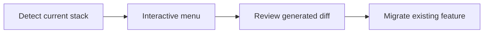

# Add the workflow to an existing project

Goal: add the feature lifecycle to a live Essensys repository without overwriting anything.

## What the bootstrap skill detects

| File found | Stack detected |
|---|---|
| `package.json` | React / Node |
| `go.mod` | Go (backend / gateway) |
| `requirements.txt` | Python |
| `playwright.config.*` | Playwright already present |
| `openspec/` | OpenSpec already present |
| `features/` | Repository already initialized |

## Step 1 — Install the skills & rules

```bash
git clone https://github.com/essensys-hub/essensys-feature-lifecycle.git
cd essensys-feature-lifecycle
./scripts/install-skills.sh /path/to/my-repo   # or --global for every repo
```

Open your existing repo in Cursor (skills/rules loaded). No change to your code at this stage.

## Step 2 — Run the interactive bootstrap

In Cursor:

```text
bootstrap feature lifecycle
```

The skill inspects the repository, then proposes a menu to:

- add `feature-gate`
- add `security-gate`
- extend `pre-commit`
- create the starter docs

Nothing is overwritten without confirmation.

## Step 3 — Review the generated diff

For an existing repository, the skill generates a migration recap:

```text
.feature-lifecycle-migration.md
```

Review the diff before committing it.

## Step 4 — Migrate one existing feature

```text
migrate <feature> to feature manifest
```

## Diagram


