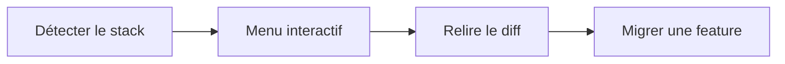

# Ajouter le workflow à un projet existant

Objectif : ajouter le feature lifecycle à un repo Essensys déjà vivant sans rien écraser.

## Ce que le skill détecte

| Fichier trouvé | Stack détecté |
|---|---|
| `package.json` | React / Node |
| `go.mod` | Go (backend / gateway) |
| `requirements.txt` | Python |
| `playwright.config.*` | Playwright déjà présent |
| `openspec/` | OpenSpec déjà en place |
| `features/` | Repo déjà initialisé |

## Étape 1 — Installer les skills & rules

```bash
git clone https://github.com/essensys-hub/essensys-feature-lifecycle.git
cd essensys-feature-lifecycle
./scripts/install-skills.sh /chemin/vers/mon-repo   # ou --global pour tous les repos
```

Ouvre ton repo existant dans Cursor (skills/rules chargés). Aucune modification de ton code à ce stade.

## Étape 2 — Lancer le bootstrap interactif

Dans Cursor :

```text
bootstrap feature lifecycle
```

Le skill analyse le repo puis propose un menu :

- ajouter `feature-gate`
- ajouter `security-gate`
- étendre `pre-commit`
- créer la doc

Rien n'est écrasé sans confirmation.

## Étape 3 — Relire le diff proposé

Pour un repo existant, le skill produit un récap de migration :

```text
.feature-lifecycle-migration.md
```

Tu relis le diff avant de committer.

## Étape 4 — Migrer une feature existante

```text
migrate <feature> to feature manifest
```

## Diagramme


